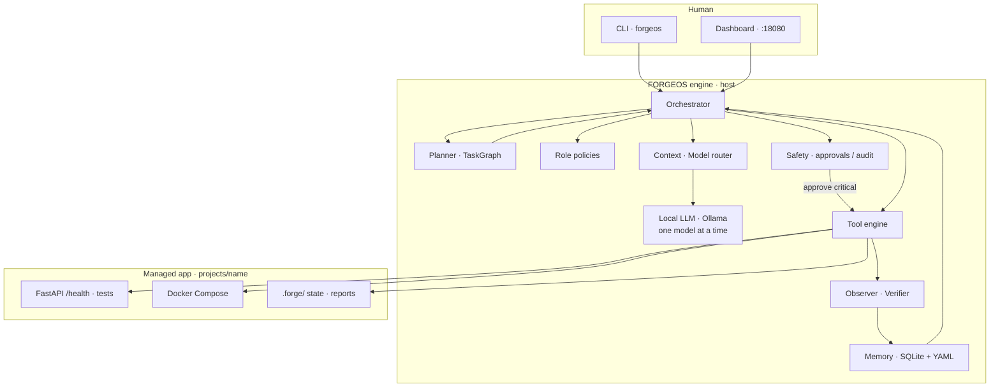

# FORGEOS

**Local AI Engineering Operating System.**

FORGEOS is a single local LLM (run through [Ollama](https://ollama.com)) wrapped in a
software-engineering loop — plan, act, observe, verify, replan — instead of a swarm of
competing agents. Job titles (CEO, PM, Architect, Frontend, QA, …) are **sequential role
policies**, not concurrent processes.

> FORGEOS does not trust the model. It trusts evidence.

## Architecture



**Loop:** PLAN → ACT → OBSERVE → VERIFY → MEMORIZE → REPLAN (human gate for critical tools like `docker.compose_up`).

System design lives in `docs/`:

| Document | Topic |
|---|---|
| [docs/ARCHITECTURE.md](docs/ARCHITECTURE.md) | System overview, loop, world state |
| [docs/ENGINE_LAYOUT.md](docs/ENGINE_LAYOUT.md) | Python package layout for the engine |
| [docs/MODEL_ROUTING.md](docs/MODEL_ROUTING.md) | Phase 0 model routing lock |
| [docs/PHASE1.md](docs/PHASE1.md) | Phase 1 what shipped / deferred |
| [docs/PHASE2.md](docs/PHASE2.md) | Phase 2 tool engine what shipped / deferred |
| [docs/PHASE3.md](docs/PHASE3.md) | Phase 3 LLM engine what shipped / deferred |
| [docs/PHASE4.md](docs/PHASE4.md) | Phase 4 planning what shipped / deferred |
| [docs/PHASE5.md](docs/PHASE5.md) | Phase 5 verification what shipped / deferred |
| [docs/PHASE6.md](docs/PHASE6.md) | Phase 6 memory what shipped / deferred |
| [docs/PHASE7.md](docs/PHASE7.md) | Phase 7 safety what shipped / deferred |
| [docs/PHASE8.md](docs/PHASE8.md) | Phase 8 engineering intelligence what shipped / deferred |
| [docs/PHASE9.md](docs/PHASE9.md) | Phase 9 dashboard what shipped / deferred |
| [docs/PHASE10.md](docs/PHASE10.md) | Phase 10 managed FastAPI demo what shipped / deferred |
| [docs/PHASE11.md](docs/PHASE11.md) | Phase 11 draft — Ollama + richer backend |
| [docs/demo/FASTAPI_HEALTH.md](docs/demo/FASTAPI_HEALTH.md) | Step-by-step FastAPI `/health` demo |
| [docs/PHASES.md](docs/PHASES.md) | Phase 0–10 map, branches, DoD notes |
| [docs/ROLES.md](docs/ROLES.md) | Eleven role policies (human-readable) |
| [roles/](roles/) | Machine-readable role YAML stubs |
| [docs/schemas/](docs/schemas/) | World state, task, decision, role schemas |
| [docs/GIT_AND_RELEASE.md](docs/GIT_AND_RELEASE.md) | Trunk-based branches, SemVer tags, hotfixes |
| [docs/PROJECT_LAYOUT.md](docs/PROJECT_LAYOUT.md) | Managed project monorepo shape |
| [docs/API_VERSIONING.md](docs/API_VERSIONING.md) | `/api/v1` for managed apps (not engine) |
| [docs/DOCKER.md](docs/DOCKER.md) | Local Compose for managed apps; Ollama on host |
| [docs/WORKFLOW.md](docs/WORKFLOW.md) | Goal → report end-to-end pipeline |
| [CHANGELOG.md](CHANGELOG.md) | Release history |

**Runnable today:** Phase 0 benchmark + Phase 1–10 CLI including `forgeos dashboard` and `init --scaffold` managed FastAPI demo. Default `run` uses MockLLM; pass `--llm ollama` for the local model path. Multi-step: `forgeos run --steps N`.

## Requirements

- Windows (developed/tested on Windows)
- Python 3.12
- For Phase 0 benchmarks and Phase 3 `--llm ollama`: [Ollama](https://ollama.com) on `PATH` and `nvidia-smi` if VRAM metrics are desired

## Setup

```powershell
python -m venv .venv
.venv\Scripts\Activate.ps1
pip install -e ".[dev]"
```

## Phase 1 — Core CLI

```powershell
forgeos init demo
forgeos run demo --goal "write hello report"
forgeos status demo
python -m forgeos --version
pytest
```

Creates `projects/demo/.forge/state.yaml` and a stub cycle report under `.forge/reports/`.

## Phase 2 — Tools CLI

```powershell
forgeos tools list
forgeos tools exec demo --role ceo --tool filesystem.tree --arg max_depth=2
forgeos tools exec demo --role backend --tool git.status
forgeos run demo --tool-demo
```

## Phase 3 — LLM CLI

```powershell
forgeos llm status
forgeos llm complete --prompt "Say OK." --task-class simple
forgeos run demo --llm ollama --goal "write hello report"
```

Requires [Ollama](https://ollama.com) on the host with `qwen3:4b` and `qwen2.5-coder:7b` pulled (see [docs/MODEL_ROUTING.md](docs/MODEL_ROUTING.md)).

## Phase 4 — Planning CLI

```powershell
forgeos plan demo --goal "ship phase4"
forgeos tasks list demo
forgeos run demo --steps 2 --goal "ship phase4"
```

## Phase 5 — Verification CLI

```powershell
forgeos classify --error "ModuleNotFoundError: No module named x"
forgeos verify demo --task task-001
```

## Phase 6 — Memory CLI

```powershell
forgeos memory sync demo
forgeos memory status demo
forgeos memory decisions demo
```

## Phase 7 — Safety CLI

```powershell
forgeos safety pending demo
forgeos safety approve demo --id appr-...
forgeos safety audit demo
forgeos checkpoint create demo --message "pre-change"
forgeos checkpoint list demo
```

## Phase 8 — Intelligence CLI

```powershell
forgeos intelligence health demo
forgeos intelligence debt demo
forgeos intelligence research demo --query "architecture"
```

## Phase 9 — Dashboard

```powershell
forgeos dashboard
# open http://127.0.0.1:18080/
```

## Phase 10 — Managed FastAPI demo

```powershell
forgeos init health-demo --scaffold
forgeos plan health-demo --goal "Create a Python FastAPI project with a /health endpoint and tests" --template fastapi-health
.\scripts\demo_fastapi_health.ps1
```

See [docs/demo/FASTAPI_HEALTH.md](docs/demo/FASTAPI_HEALTH.md) and [docs/PHASE10.md](docs/PHASE10.md). `docker.compose_up` requires `forgeos safety approve` before containers start.

## Phase 0 — Benchmark

Requires Ollama and benchmark deps (`pip install -r requirements.txt`). Pull models once:

```powershell
ollama pull qwen3:4b
ollama pull qwen2.5-coder:7b
```

Runs a fixed set of `simple` / `coding` / `planning` prompts against each model,
capturing tokens/sec, time-to-first-token, and CPU/RAM/VRAM deltas.

```powershell
# Run the benchmark (defaults to qwen3:4b and qwen2.5-coder:7b, 2 runs per prompt)
python -m benchmarks.phase0.bench

# Render the latest results as a report (terminal + markdown file)
python -m benchmarks.phase0.report
```

Results are written to `benchmarks/phase0/results/`:

- `<timestamp>.json` — raw per-run measurements (gitignored, regenerate anytime)
- `<timestamp>_report.md` — human-readable summary (kept in git)

## Project layout

```text
FORGEOS/
├── docs/                       # system architecture pack + schemas
├── roles/                      # role policy YAML (loaded in Phase 1+)
├── forgeos/                    # Python package (Phase 1+ core engine)
├── tests/                      # pytest suite
├── projects/                   # managed app sandboxes (gitignored contents)
├── benchmarks/
│   └── phase0/
│       ├── prompts.py          # fixed benchmark prompt set
│       ├── system_metrics.py   # CPU / RAM / VRAM sampling helpers
│       ├── bench.py            # benchmark runner
│       ├── report.py           # results -> terminal + markdown report
│       └── results/            # output directory
├── pyproject.toml
├── CHANGELOG.md
├── requirements.txt
└── README.md
```

Later phases implement the contracts in `docs/` / `roles/` inside `forgeos/` and build on Phase 0 model-routing results. See [docs/PHASES.md](docs/PHASES.md).
